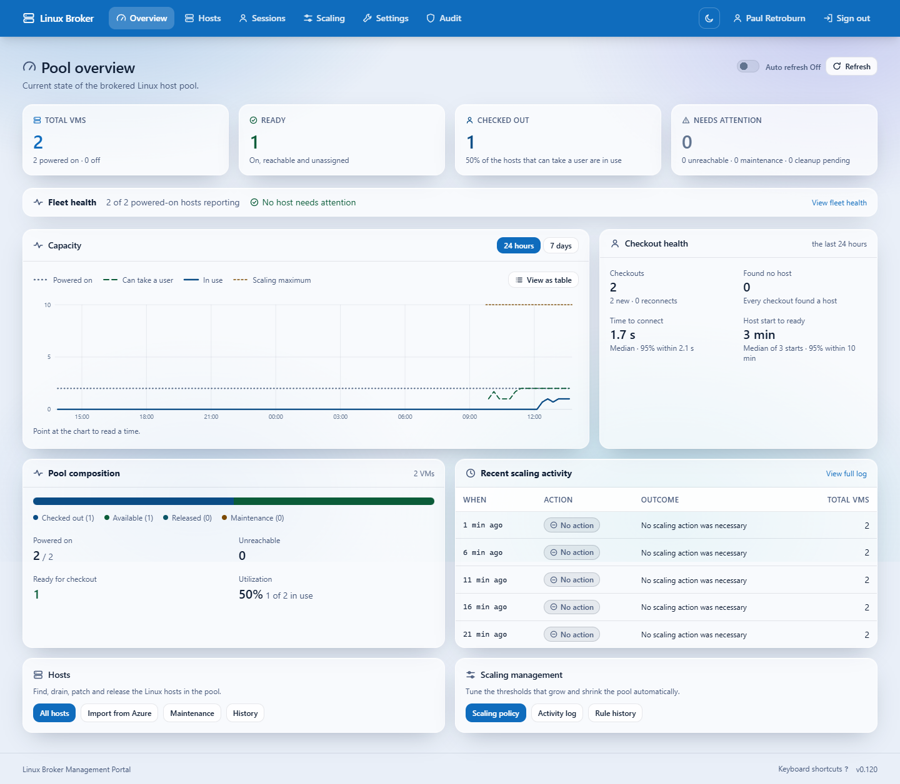
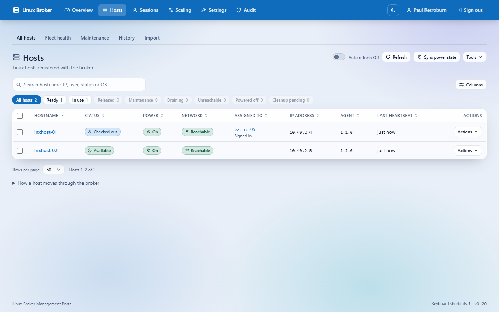
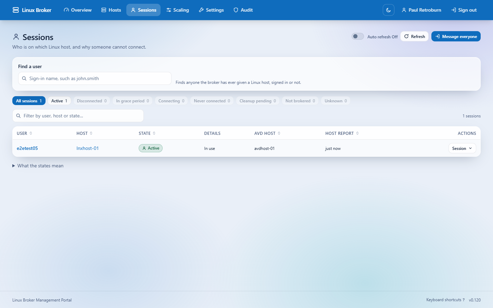
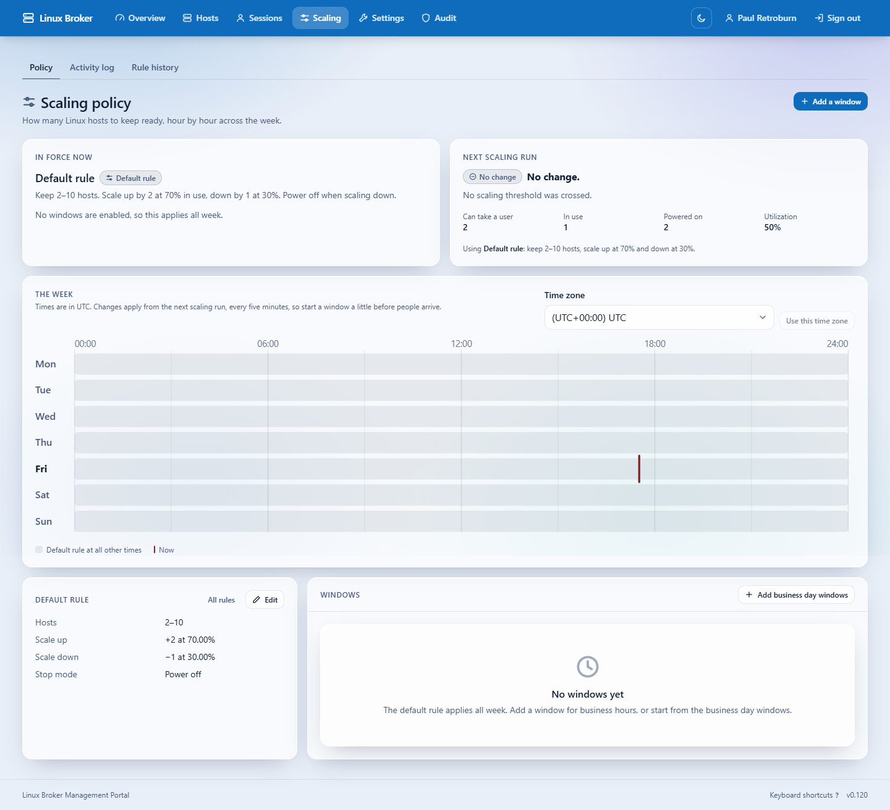

# Linux Broker for Azure Virtual Desktop (AVD) Access

[](LICENSE)

## Purpose

The **Linux Broker for AVD Access** is a solution designed to manage and broker user access to Linux hosts via Azure Virtual Desktop (AVD). It provides a scalable and efficient way to connect users to full desktops on Linux virtual machines (VMs) over the Remote Desktop Protocol (RDP), which the hosts serve with xrdp.

This solution leverages Azure services such as managed identities, security groups, Azure App Service, Azure Functions, and Azure SQL Database to provide secure and efficient brokering, session management, and scaling of Linux hosts.


## Architecture Description

The solution consists of the following components:

- **Azure Virtual Desktop (AVD)**: Provides the interface for users to access Linux hosts. Users can connect via the AVD web client or any supported AVD client.

- **Broker Agent (`Connect-LinuxBroker.ps1`)**: A PowerShell script running on each AVD host that acts as an agent to broker connections to Linux hosts. It connects to the Broker API using managed identity to check out a Linux VM and opens a Remote Desktop connection to it.

- **Linux Hosts Cluster**: A set of Linux VMs that users connect to. Each Linux host has managed identity enabled and runs a Session Release Agent.

- **Session Release Agent**: A host-side reconciliation service that keeps the periodic poll as a safety net, uses XRDP/Xorg session inspection as the source of truth, and can wake early from `systemd-logind` signals to shorten disconnect detection time. It enforces the configured reconnect window before final logoff and cleanup, and also fetches the fleet-wide host settings profile on each run.

- **Broker API**: A RESTful API running on Azure App Service that handles interactions between the Broker Agent, Session Release Agent, and the Broker Database. It uses managed identities and Azure Key Vault for secure access to resources.

- **Broker Database**: An Azure SQL Database that stores information about virtual machines, scaling rules, and scaling activity. It includes the following tables:
  - `virtual_machines`: Stores information about Linux VMs, including hostname, IP address, power state, network status, VM status, connected username, AVD host, and VM ID.
  - `vm_scaling_rules`: Stores scaling rules for the Linux host cluster.
  - `vm_scaling_activity`: Logs scaling activities such as VMs being turned on or off.
  - `LinuxHostSettings`: Stores the fleet-wide Linux host settings profile that administrators manage from the portal.
  - `ScalingPolicy` and `ScalingSchedules`: The scaling policy's time zone and the time windows that override the default scaling rule.
  - `CheckoutEvents` and `HostStartEvents`: Each checkout's outcome and each host start's time to ready, for the dashboard's trends.
  - `MaintenanceRuns` and `MaintenanceRunHosts`: Rolling maintenance runs and each host's progress through them.
  - `AuditLog` and `HostHeartbeats`: Who did what, and each host agent's latest report.

- **Azure Function for Scaling Tasks**: An Azure Function that runs on a schedule to manage scaling of Linux hosts based on the scaling rules. It updates VM network statuses, turns VMs on or off, performs health checks on the Linux hosts, returns released hosts, advances rolling maintenance runs, and purges old audit entries and checkout events.

- **Service Management Portal**: A front-end web application that allows administrators to manage VMs, scaling rules, and monitor the system. It provides functionalities such as finding and acting on hosts in bulk, importing hosts from Azure, helping users with their sessions, scheduling scaling, patching hosts in rolling maintenance runs, charting capacity and unmet demand, and viewing logs. It is a React 18 and TypeScript single-page app built with Vite and Tailwind CSS, served by a Flask backend-for-frontend that holds the Entra ID token server-side and calls the Broker API on the administrator's behalf.

- **Azure Key Vault**: Stores sensitive information such as SSH keys and database passwords, accessed securely by the Broker API using managed identity.

- **Managed Identities and Security Groups**: Used throughout the solution to securely authenticate and authorize different components. AVD hosts and Linux hosts have managed identities and are members of respective security groups.

The architecture ensures secure, efficient, and scalable management of Linux host access via AVD.


## List of Services

- **Azure Virtual Desktop (AVD)**: Provides virtual desktop infrastructure.
- **Broker Agent (`Connect-LinuxBroker.ps1`)**: PowerShell script acting as an agent on AVD hosts.
- **Linux Hosts Cluster**: The set of Linux VMs users connect to.
- **Session Release Agent**: Systemd-timer-based reconciliation service on Linux hosts, optionally accelerated by a `systemd-logind` watcher.
- **Broker API**: RESTful API for brokering connections and managing VMs.
- **Broker Database**: Azure SQL Database for storing VM and scaling data.
- **Azure Function for Scaling Tasks**: Manages scaling of Linux hosts.
- **Service Management Portal**: React and TypeScript front-end application for administrators, served by a Flask backend-for-frontend.
- **Azure Key Vault**: Secure storage for SSH keys and passwords.
- **Managed Identities**: Used for secure authentication between components.
- **Security Groups**: Controls access permissions for managed identities.

## User Workflow

1. **User Logs into AVD**: The user accesses the AVD web client or any supported client.
2. **Selects Linux Host Connection**: The user opens the **Linux Desktop** RemoteApp, which the `azd` deployment publishes, for a full RDP session to a Linux host.
3. **Broker Agent Initiates Connection**:
   - The Broker Agent script (`Connect-LinuxBroker.ps1`) connects to the Broker API using the AVD host's managed identity.
   - It checks out an available Linux VM for the user.
   - The user's ID is added to the Linux host with a unique 25-character password.
   - The user is added to appropriate user groups on the Linux host for RDP access.
4. **User Connects to Linux Host**: The user is connected to the Linux host via RDP and can work as needed.
5. **Session Management**:
   - If the user disconnects or logs off, the Session Release Agent on the Linux host reconciles the XRDP/Xorg session state immediately when possible and otherwise on the next safety-net poll.
   - A reconnect timer is initiated, 20 minutes by default and configurable from the portal.
   - If the user reconnects within that window, they return to the same host and profile. With **Keep sessions alive during the grace period** turned on in Host Settings, they also resume the same desktop and running applications; otherwise the desktop is closed at disconnect and they start a fresh one.
   - If not, the user is signed off and the VM is returned. It becomes available to other users once the user's account has been removed from the host.

## Admin Workflow

What an administrator can do depends on their role (see [RBAC Permissions](#rbac-permissions)).

1. **Access Service Management Portal**: Admins log into the front-end portal (see [Service Management Portal](#service-management-portal)).
2. **Manage hosts**:
   - **Find hosts**: The host list pages, searches, filters by status (ready, in use, released, maintenance, draining, unreachable, off, cleanup pending) and sorts on the server, with optional columns for OS, agent, settings, last heartbeat and sessions.
   - **Act on many hosts at once**: Select hosts to drain, return to service, start, stop, apply settings, send a message, start maintenance or delete them. Hosts an action does not apply to are skipped and named, and each host's outcome is reported.
   - **Import from Azure**: Register the Linux VMs tagged `broker-role=linux-host` that the broker does not know yet, with the address DNS gives them. **Add a host manually** stays as the fallback.
   - **Delete VMs**: Remove VMs from the system.
   - **Start, stop and restart**: Power a host on or off in Azure from its row's **Actions** menu or its page. Stopping or restarting a host a user is signed in to needs `FullAccess` and the hostname typed to confirm, and stopping it ends the user's assignment.
   - **Drain and return to service**: Take a host out of rotation without disturbing its current user. A draining host takes no new users and moves to maintenance when its assignment ends; an idle host moves to maintenance at once.
   - **Release and return**: End a user's assignment early. A returned host stays **Cleanup pending** until the user's account has been removed from it; cleanup is retried automatically, or on demand with **Retry cleanup**.
   - **Sync power state**: Correct every host's recorded power state from Azure now.
   - **Repair VM records**: **Update attributes** edits what the broker has recorded for a host (FullAccess only). It does not start or stop the VM.
   - **Rolling maintenance**: Patch (security updates or everything) or restart a set of hosts a batch at a time while users keep working. Each host is drained, patched over SSH, restarted, verified and put back the way it was found, and enough hosts stay ready throughout. An optional deadline warns users and then signs them out.
   - **Test brokering**: Ask the broker for a host the way AVD does, from the host list's **Tools** menu (FullAccess only).
3. **Help users**:
   - **Sessions**: See who is on which host and why someone cannot connect: active, disconnected, in their grace period, still connecting, never connected, waiting for cleanup.
   - **Find a user**: See where they are now, the hosts they had and the recent actions on them.
   - **Sign out and message**: Sign a user out (optionally returning the host), send a message to their session, or send one message to every session or to the sessions on chosen hosts, for example before a restart.
   - **Reset a profile**: Give a user a fresh profile at their next new assignment (FullAccess only). The old profile is kept, renamed.
4. **Manage Scaling**:
   - **Edit the default rule**: Set the minimum and maximum number of running VMs, the scale-up and scale-down thresholds and increments, and whether scale-down powers VMs off or deallocates them.
   - **Add schedule windows**: Override the default rule on chosen days and times in one time zone, for example business hours, and see what the next run would do before saving.
5. **Manage Linux Host Settings**:
   - **Edit the fleet-wide profile**: Change the reconnect grace period, whether disconnected sessions are kept alive, the reconcile interval, watcher timings, idle session timeout, and screen lock policy without editing or redeploying any script.
   - **Apply Now**: Optionally push the profile to hosts immediately instead of waiting for them to pick it up.
   - **Review drift**: See which hosts have applied the current settings version.
   - **Version history**: See what changed in each saved version of the profile, and who saved it.
6. **Monitor System**:
   - **Overview**: Capacity and checkout health over a day or a week, including checkouts that found no host, and an **Attention** panel for what needs an operator now.
   - **View VM Details**: Access detailed information about VMs, including what the host's agent last reported.
   - **Fleet health**: See each host's last heartbeat, agent version, OS, desktop, xrdp and NFS state, load, memory, disk and sessions, and which hosts need attention, without SSH.
   - **Audit log**: See who did what: every portal action, every denied attempt, and the changes the broker makes on its own, with CSV export.
   - **View Scaling Activity Logs**: Monitor scaling activities and history, including why each run did or did not act.
   - **View VM History**: Track the usage and status changes of VMs.

## Service Management Portal

These screenshots come from a live deployment with two RHEL 9 Linux hosts, one of them in use.

**Pool overview.** Capacity and checkout health over the last day or week, what needs an operator now, fleet health, and the latest scaling runs.



**Hosts.** Every Linux host with its status, power, network, current user and last heartbeat. The list is filtered, searched and sorted on the server, and hosts can be selected for bulk actions or imported from Azure.



**Sessions.** Who is on which host and why someone cannot connect, with a search for any user the broker has provisioned, and sign-out and messages for each session.



**Scaling policy.** What is in force now, what the next scaling run would do and why, the week's schedule windows, and the default rule.



## RBAC Permissions

The solution uses Role-Based Access Control (RBAC) to secure access. Every Broker API endpoint checks the caller's app roles; the portal only hides what a role cannot do.

- **Management Portal Users**: assign one of these app roles on the Broker API's enterprise application, to users directly or to groups (group assignment needs Microsoft Entra ID P1 or P2):

  | Role | Allows |
  | --- | --- |
  | `Reader` | Viewing everything in the portal, including fleet health and the audit log. |
  | `Operator` | Everything `Reader` can do, plus releasing and returning hosts, retrying cleanup, draining hosts and returning them to service, starting hosts, stopping and restarting hosts no one is using, syncing power states, pushing host settings with **Apply Now**, and signing users out and messaging their sessions. |
  | `FullAccess` | Everything `Operator` can do, plus stopping and restarting hosts in use, adding, importing and deleting VMs, repairing VM records, testing brokering, running maintenance, resetting profiles, and editing the scaling rule, schedules and host settings. |

  The portal signs users in with the delegated `access_as_user` scope, but the scope alone no longer grants anything: a signed-in user without one of these roles sees a **No access** page. The deployment assigns `FullAccess` to the user who runs it. When upgrading, see [Upgrading an existing deployment](#upgrading-an-existing-deployment).
- **Broker Agent (AVD Hosts)**:
  - **Role**: `AvdHost` on the Broker API.
  - **Permissions**: Access to the `checkout` API endpoint.
  - **Requirements**: Must be using managed identity and be a member of the `LinuxBroker-AVDHost-VMs` security group.
- **Session Release Agent (Linux Hosts)**:
  - **Role**: `LinuxHost` on the Broker API.
  - **Permissions**: Access to release VMs, read the host settings profile, and acknowledge the settings version applied.
  - **Requirements**: Managed identity and membership in `LinuxBroker-LinuxHost-VMs` security group.
- **Azure Function (Scaling Tasks)**:
  - **Role**: `ScheduledTask` on the Broker API.
  - **Permissions**: Access to APIs for listing VMs, recording network status, returning released VMs, triggering scaling, advancing maintenance runs, and purging old audit entries and checkout events.
- **Broker API**:
  - **Permissions**: Has API permissions to Microsoft Graph for directory and group read access to validate managed identities and security group memberships.
- **Managed Identities**:
  - **AVD Hosts and Linux Hosts**: Each has a managed identity used for authentication.
  - **Security Groups**: Managed identities are added to respective security groups to control API access.


## Database Setup

The database component is essential for storing VM information, scaling rules, and activity logs. For detailed instructions on setting up the Azure SQL Database and deploying the stored procedures, please refer to the [Database Setup Documentation](sql_queries/README.md).

## Custom Script Extension

The **Custom Script Extensions** automate the configuration of both the AVD hosts and Linux hosts, ensuring they are prepared to support user access and integration with the Linux Broker for AVD solution.

### **AVD Host Configuration**

The custom script extension for the AVD host:

- **Installs the Linux Broker Agent**: Downloads and sets up the Linux Broker Agent (`Connect-LinuxBroker.ps1`) on the AVD host.
- **Configures Required Libraries**: Installs necessary authentication libraries to enable secure communication with the Broker API using managed identity.
- **Prepares the Host for User Connection**: Configures the AVD host to support seamless user connections, allowing them to access the Linux desktop via Azure Virtual Desktop.

### **Linux Host Configuration**

The custom script extensions support the following Linux distributions:

- **Red Hat Enterprise Linux (RHEL) 8 and 9**
- **Ubuntu 24.04**: Canonical's server image, with a desktop added

Each deployment chooses the desktop its hosts run with `linuxHostDesktop`:

- **GNOME**, the default: the `Server with GUI` group on RHEL, and on Ubuntu the Ubuntu desktop, which xrdp sessions run as Ubuntu on Xorg
- **Xfce**
- **MATE**

On RHEL, Xfce and MATE come from EPEL.

These scripts:

- **Install xrdp**: Set up xrdp for full desktop access over RDP, enabling users to connect via AVD. The host firewall allows only SSH and RDP.
- **Start the desktop**: xrdp starts every session through `xrdp-startwm.sh`, which runs the desktop the deployment chose.
- **Configure Authentication**: Sets up authentication mechanisms for secure user access.
- **Deploy the Linux Session Release Agent**: Installs the timer-based reconciliation service plus a `systemd-logind` watcher that can trigger early reconciliations. The timer remains the fallback path so the system still converges even if event delivery is delayed or unavailable.
- **Install the Host Settings Agent**: Installs `apply-host-settings.sh` and seeds the settings profile, so screen lock policy and session timings are applied consistently on every supported distribution rather than only on RHEL 8. `LINUXBROKER_DISABLE_SCREEN_LOCK` still chooses the screen lock posture that is seeded; from then on the values are managed from the portal.
- **Install the session and patch helpers**: `session-control.sh` lets the broker sign users out, show them messages and reset their profiles, and `patch-host.sh` runs the package upgrade for a rolling maintenance run. Both are allowlisted for the broker's SSH account and validate their input, and `session-control.sh` acts only on accounts the broker created.

## Additional Details

### Scaling Rules

- **One default rule**: the rule with the lowest ID. Creating a second rule is refused; edit the existing one.
- **Schedule windows**: Optional windows override the default rule on chosen days and times, read in one policy time zone, for example Monday to Friday 08:00–18:00 with a higher minimum. A window can run past midnight, enabled windows cannot overlap, and outside every window the default rule applies. A window takes effect at the next scaling run, about every five minutes.
- **Minimum VMs Running**: At least 1. Whenever fewer serviceable hosts are running (powered on, not in maintenance, and reachable or still booting), hosts are started to reach it.
- **Maximum VMs Running**: The maximum number of Linux VMs allowed to be powered on, including hosts in maintenance. When the two conflict, the minimum wins: a scale-down never leaves fewer serviceable hosts than the minimum.
- **Scale-Up Ratio**: The utilization at which more VMs are started (e.g., 80%). Utilization is hosts in use (checked out, released within their grace period, or pending cleanup) divided by serviceable hosts.
- **Scale-Up Increment**: The number of VMs to start when scaling up.
- **Scale-Down Ratio**: The utilization at or below which VMs are stopped (e.g., 30%).
- **Scale-Down Increment**: The number of VMs to stop when scaling down. Only idle, reachable, unassigned hosts that have stayed in their current power state for at least 10 minutes are stopped, highest VMID first.
- **Stop mode**: **Power off** (the default) keeps the VM's compute allocation, so it starts quickly but compute is still billed. **Deallocate** stops compute billing, but starts take longer, and in a capacity-constrained region or VM size a start can fail with `AllocationFailed` (the broker records the host as off and retries on a later run). Deallocation also wipes the temporary disk; private IP addresses and host names are kept.

Every run first reads each host's power state from Azure and corrects the broker's record, runs never overlap, and each run writes an activity log entry whose notes explain the decision. Before this release, scaling decisions were recorded but never sent to Azure, so upgrading makes scaling start and stop VMs for the first time.

### Session Release Mechanism

- **Session Monitoring**: The Session Release Agent reconciles XRDP/Xorg session state on a timer (60 seconds by default) and can also wake early from `systemd-logind` session signals.
- **Release State**: When a session is disconnected, the VM enters a 'released' state, allowing the user to reconnect within the configured grace period (20 minutes by default). The desktop itself is closed at disconnect unless **Keep sessions alive during the grace period** is turned on, in which case it keeps running until the grace period expires.
- **Session Termination**: If the user does not reconnect within that window, the host signs them off. The broker returns the VM once the grace period, one reconcile interval and a further 60 seconds have passed, then keeps it **Cleanup pending** until the user's account has been removed and the home unmounted. Cleanup is retried automatically about every two minutes while the host is on and reachable, and operators can retry it from the portal. Only then can the VM be checked out by someone else.
- **Idle Sessions**: When an idle timeout is configured, a user who stays connected but inactive is disconnected, which starts the same grace period. With **Keep sessions alive** turned on they can reconnect and resume; otherwise they get a fresh desktop on the same host. If they do not reconnect, the VM is reclaimed. This is disabled by default.

### Linux Host Settings

Administrators manage host behavior from the **Host Settings** page in the Service Management Portal instead of editing scripts. The settings form a single fleet-wide profile stored in `dbo.LinuxHostSettings`.

| Setting | Default | Range | Effect |
| --- | --- | --- | --- |
| Reconnect grace period | 1200 s | 60–86400 | How long a disconnected user can reconnect before the VM is reclaimed |
| Keep sessions alive during the grace period | false | boolean | Keeps a disconnected desktop running until the grace period expires, so a reconnect resumes it. Cannot be combined with **Screen lock enabled**. Hosts need the current agent scripts |
| Reconcile interval | 60 s | 30–900 | How often each host re-checks session state |
| Watcher debounce | 10 s | 1–300 | Minimum gap between `logind`-triggered reconciliations |
| Watcher settle | 2 s | 0–60 | Pause after a `logind` signal before reconciling |
| Idle timeout | 0 (disabled) | 0, or 300–86400 | Inactivity before a connected user is disconnected |
| Idle warning lead time | 120 s | 0–900 | On-screen warning before the idle timeout, must be less than the timeout |
| Remove the lock screen | true | boolean | Stops the screen from locking at all. On GNOME it also removes the Super+L shortcut and the Lock menu entry |
| Screen lock enabled | false | boolean | Whether the screen locks when the screensaver activates |
| Screen blank delay | 0 (never) | 0–86400 | Inactivity before the screen blanks |
| Screen lock delay | 0 (immediate) | 0–86400 | Delay between blanking and locking |
| Lock screen settings | true | boolean | Locks the screen lock values in dconf, and in xfconf on Xfce hosts, so users cannot override them |

The session lifecycle defaults match the values that were previously hardcoded, so adopting this feature changes no behavior until an administrator edits the profile.

The screen lock defaults preserve the posture set by `LINUXBROKER_DISABLE_SCREEN_LOCK`: the lock screen is removed, because a locked GNOME greeter inside an xrdp session frequently cannot be unlocked after a reconnect, which strands the host's lease. That environment variable still chooses the posture seeded at provisioning time; from then on the values are managed from the portal. Set **Screen lock enabled** on and **Remove the lock screen** off to satisfy a STIG or CIS idle-lock control.

The same values apply to every desktop. Xfce and MATE count the screen blank and lock delays in whole minutes, up to 8 hours, so the blank delay is rounded up and the lock delay to the nearest minute, and Xfce sessions pick up a change when they start. **Host Settings** notes this when the fleet has Xfce or MATE hosts. See [Linux Host Screen Lock](deploy/DEPLOYMENT.md#linux-host-screen-lock) for the files each desktop reads.

**Keep sessions alive during the grace period** and **Screen lock enabled** are mutually exclusive: a resumed session behind a lock screen cannot be unlocked, because users never know the password the broker sets at each checkout. Hosts that have not been updated with `deploy/Migrate-LinuxHostReleaseAgent.ps1` keep closing desktops at disconnect and show as pending in the drift table once the setting is on.

#### How settings reach the hosts

Delivery is a hybrid of pull and push, mirroring the timer-plus-watcher design of the release agent itself:

- **Pull (the convergence mechanism)**: each host fetches the profile at the start of every reconcile run using the managed identity it already has, caches it to `/etc/linuxbroker/host-settings.conf`, and reports the version it applied. Hosts that were powered off, unreachable, or created later by scale-up converge on their own with no operator action.
- **Push (for immediacy)**: **Apply Now** in the portal has the Broker API connect to each reachable host over SSH so a change takes effect at once. A host missed by a push is not left stale; it simply picks the change up on its next reconcile run.

Values are validated at every layer: SQL `CHECK` constraints, API request validation, and a clamp inside the host-side apply script. A settings fetch failure never blocks reconciliation, and idle enforcement is skipped rather than guessed if idle time cannot be read.

Because the profile is versioned, the portal shows which hosts have applied the current version and which are still pending.

### Security and Authentication

- **Managed Identities**: Used for secure authentication between Azure resources without storing credentials.
- **Azure Key Vault**: Stores SSH keys and database passwords securely, accessed via managed identities.
- **API Permissions**: Specific API permissions are granted to components to restrict access based on roles.
- **Logging and Monitoring**: All activities are logged to Azure Application Insights and Log Analytics Workspace.

### AVD Host Sizing Recommendations

- [Session host virtual machine sizing guidelines for Azure Virtual Desktop and Remote Desktop Services | Microsoft Learn](https://learn.microsoft.com/en-us/windows-server/remote/remote-desktop-services/virtual-machine-recs#multi-session-recommendations)

Given that AVD acts as a pass-through in this solution, starting with **light to medium workload sizing** is recommended. This provides a good balance of performance and efficiency without overprovisioning resources. The following table outlines the suggested configurations:

| Workload Type | Maximum Users per vCPU | Minimum Configuration             | Example Azure Instances                                      | Minimum Profile Storage |
| ------------- | ---------------------- | --------------------------------- | ------------------------------------------------------------ | ----------------------- |
| Light         | 6 users per vCPU       | 8 vCPUs, 16 GB RAM, 32 GB storage | D8s_v5, D8s_v4, F8s_v2, D8as_v4, D16s_v5, D16s_v4, F16s_v2, D16as_v4 | 30 GB                   |
| Medium        | 4 users per vCPU       | 8 vCPUs, 16 GB RAM, 32 GB storage | D8s_v5, D8s_v4, F8s_v2, D8as_v4, D16s_v5, D16s_v4, F16s_v2, D16as_v4 | 30 GB                   |

#### **Key Considerations:**

1. **Start with Light Workloads**:
   - For initial deployments, use light workload sizing (6 users per vCPU). This provides a good balance, allowing up to 48 users on an 8-core VM.
   - This configuration aligns well with the pass-through nature of the solution, minimizing unnecessary overhead.
2. **Adjust for Medium Workloads if Necessary**:
   - If users experience performance degradation, consider switching to a medium workload configuration (4 users per vCPU).
   - This reduces the user density per core and provides more headroom for CPU-intensive operations.
3. **VM Sizing Recommendations**:
   - Use VMs with at least 8 vCPUs and 16 GB of RAM. This configuration avoids stability issues seen with smaller VMs and provides sufficient resources for user sessions.
   - Avoid using VMs with more than 24 vCPUs to prevent diminishing returns due to increased synchronization overhead.
4. **Optimize for Multi-Session Workloads**:
   - Use multiple smaller VMs (e.g., 8-core instances) rather than fewer large VMs. This allows for better load balancing and resource management.
   - Smaller VMs can be shut down when not in use, conserving resources and reducing costs. Use Azure autoscale to manage VM power states based on demand.

## Getting Started

The supported deployment entrypoint for this repository is in `deploy/`.

For the full deployment walkthrough, see [deploy/DEPLOYMENT.md](deploy/DEPLOYMENT.md).

That guide covers:

- prerequisites and required permissions
- azd environment values and defaults
- how `azd up` prompts for subscription and deployment region when not pre-set
- choosing between Azure commercial, Azure US Government, and custom or sovereign clouds
- Entra app and group bootstrap behavior
- SSH key reuse, prompt, and auto-generation behavior
- what `preprovision`, Bicep provisioning, and `postprovision` each do
- the separate migration path for existing deployed environments
- SQL bootstrap, Linux host SQL registration, and validation steps
- troubleshooting and rerun paths

Quick start from the repository root:

```powershell
cd .\deploy
azd env new <environment-name>
azd up
```

For existing environments that need in-place rollout instead of new-environment provisioning, use [deploy/Migrate-ExistingEnvironment.ps1](deploy/Migrate-ExistingEnvironment.ps1) from the `deploy/` directory. `azd up` remains the supported greenfield path.

The deployment targets Azure commercial by default. Set `azureCloudName` to `AzureUSGovernment` or `AzureCustom` to deploy elsewhere; commercial and Government resolve their endpoints automatically, while custom and sovereign clouds require their own authority, Graph, STS, and App Service FQDNs. Air-gapped environments should also set `scriptSourceRoot` to a reachable mirror of this repository, because the Linux hosts download their agent scripts from it during bootstrap.

The Service Management Portal serves all of its front-end assets from its own container under `front_end/static/dist/`. The bundle is compiled during the container build, uses the system font stack, and draws its icons as inline SVG, so it makes no requests to a public CDN and renders correctly in Government, sovereign and air-gapped environments where outbound internet access is blocked. Note that building the portal image does require access to the npm registry, so a disconnected build host needs an internal npm mirror. See [front_end/README.md](front_end/README.md).

The deployment defaults the App Service plan to Premium v3 `P2mv3`, which provides the minimum supported baseline of 4 vCPUs and 32 GB memory for the frontend, API, and task apps.

Before running `azd up`, review the detailed guide and set any environment-specific values you need, especially networking, host counts, VM sizes, App Service plan sizing, and SQL firewall access. The deployment scripts under `deploy/` now handle the Entra bootstrap, SSH key flow, App Service health checks on `/health`, Application Insights wiring for the frontend and API, post-provision role assignment, container image builds, SQL initialization, and Linux host SQL registration used by this solution.

## Upgrading an existing deployment

Upgrading from a release before role-based access changes behavior you should plan for. The full procedure is in [deploy/DEPLOYMENT.md](deploy/DEPLOYMENT.md#upgrading-to-role-based-access-and-working-scaling).

- **Scaling starts and stops VMs.** Earlier releases recorded scaling decisions without sending them to Azure. Review the scaling rule (the minimum is now at least 1) before upgrading, because idle hosts above the minimum will be powered off.
- **Portal access needs a role.** Assign `Reader`, `Operator` or `FullAccess` to every administrator before upgrading, or deploy once with `allowLegacyScopeAccess=true` and turn it off after the roles are assigned.
- **Returned hosts are cleaned before reuse.** A host is not handed to the next user until the previous user's account is gone, and the released-VM sweep now follows the configured grace period instead of a fixed 30 minutes.
- **Update the Linux hosts.** Run `deploy/Migrate-LinuxHostReleaseAgent.ps1` so hosts get single-call provisioning, the lease handling that keeps a signed-in user's host pending, support for keeping sessions alive, and heartbeats. Hosts that are not migrated keep working with the previous behavior.
- **Size the database.** The API now serves requests concurrently and caps its SQL connections per worker (`DB_MAX_CONCURRENCY`). The default Basic tier suits small pools; set `sqlDatabaseSkuName` to `S1` or higher for larger fleets.

The admin console foundations (audit log, host actions and drain, fleet health) need no new Azure resources or roles. See [Upgrading To The Admin Console Foundations](deploy/DEPLOYMENT.md#upgrading-to-the-admin-console-foundations).

The rest of the admin console (sessions, broadcast messages, scaling schedules, trends, rolling maintenance and the new host list) needs no new Azure resources or roles either, but the Linux hosts need agent 1.1.0 for sign-out, messages, profile resets and patching. See [Upgrading To The Complete Admin Console](deploy/DEPLOYMENT.md#upgrading-to-the-complete-admin-console).

## Roadmap

Planned work beyond this release, including RHEL 10 support, starting a host on demand, golden images and multi-session hosts, is described in [docs/ROADMAP.md](docs/ROADMAP.md).

## Contributing

Contributions are welcome! Please read the [CONTRIBUTING](CONTRIBUTING.md) guidelines for more information.

## License

This project is licensed under the MIT License - see the [LICENSE](LICENSE) file for details.
